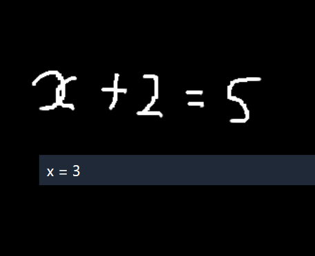
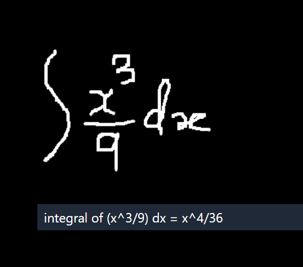

---

# BrainWave - Solver 🧠🖊️

Welcome to **BrainWave - Solver**, where your doodles meet math! This project combines a canvas drawing interface with the power to analyze mathematical expressions – perfect for solving those pesky equations with a flick of the wrist (or mouse, really). No more staring blankly at the board; now you can *draw* your way to success!

## Table of Contents

- [Introduction](#introduction)
- [Demo](#demo)
- [Features](#features)
- [Installation](#installation)
- [Usage](#usage)
- [Contributing](#contributing)
- [License](#license)

## Introduction

**BrainWave - Solver** is a web-based canvas drawing app where you can unleash your inner mathematician by sketching math symbols, expressions, or just scribbling. This project is designed to recognize and analyze these drawings, turning them into understandable mathematical expressions (aka solving them). No need to worry if you're not good at drawing – as long as your math doodles are recognizable, this solver's got your back!

> "It's not just drawing; it's *artistic problem-solving*."

## Demo

Here are some images showcasing how **BrainWave - Solver** works:





(Replace the `path/to/your/imageX.png` with the actual paths to your demo images.)

## Features

- 🖌️ **Canvas Drawing**: Start with a blank slate and draw your equations like a true mathematician.
- ✏️ **Color Palette**: Switch between colors for some *fancy* mathematical artwork. Because why shouldn't solving equations look good?
- ✂️ **Eraser**: Made a mistake? It happens. Enable the eraser tool and clean up your canvas in seconds.
- 💡 **Equation Analysis**: Automatically analyzes your drawings and provides mathematical insights using LaTeX for professional representation.
- 🚀 **Clear and Analyze**: Easily reset the canvas and re-analyze as often as needed.
- 🧮 **Latex Support**: Get that clean, professional math output in real-time.

## Installation

Ready to get your hands dirty? Follow these steps to set up BrainWave - Solver:

1. **Clone this repository**:
   ```bash
   git clone https://github.com/yourusername/BrainWave-Solver.git
   cd BrainWave-Solver
   ```

2. **Install the dependencies**:
   ```bash
   npm install
   ```

3. **Start the development server**:
   ```bash
   npm run dev
   ```

4. **Open the app**: Open your browser and go to `http://localhost:3000`.

And voila! You’re now ready to doodle your way through equations!

## Usage

1. **Draw on the canvas**: Whether it's a quadratic equation or a squiggly line (we don't judge), just start drawing.
2. **Pick a color**: Make your drawings stand out – after all, math can be beautiful.
3. **Enable Eraser**: Realized that 1 + 1 ≠ 3? Oops! Quickly erase and correct your work.
4. **Analyze**: Let the solver do the heavy lifting and convert your drawings into understandable expressions. You’ll get the result displayed as a LaTeX equation.

### Pro Tips:
- If you want to really test the solver, try drawing complex equations. Who knows, it might just surprise you!
- And don’t worry if your drawings are more Picasso than Pythagoras; the solver does its best to interpret your artistic genius.

## Contributing

Want to make this project even better? We welcome all contributions!

1. Fork the repo
2. Create your feature branch:
   ```bash
   git checkout -b feature/my-feature
   ```
3. Commit your changes:
   ```bash
   git commit -m 'Add some feature'
   ```
4. Push to the branch:
   ```bash
   git push origin feature/my-feature
   ```
5. Open a pull request!

> **Fun Fact**: The more you contribute, the more your code becomes part of the solver's brainwave. 😄

## License

Distributed under the Rakesh@Bug License.

---

Now go ahead, grab a stylus or your mouse, and turn your **brainwaves** into solutions. We’re excited to see what kind of equations you *draw up*!
